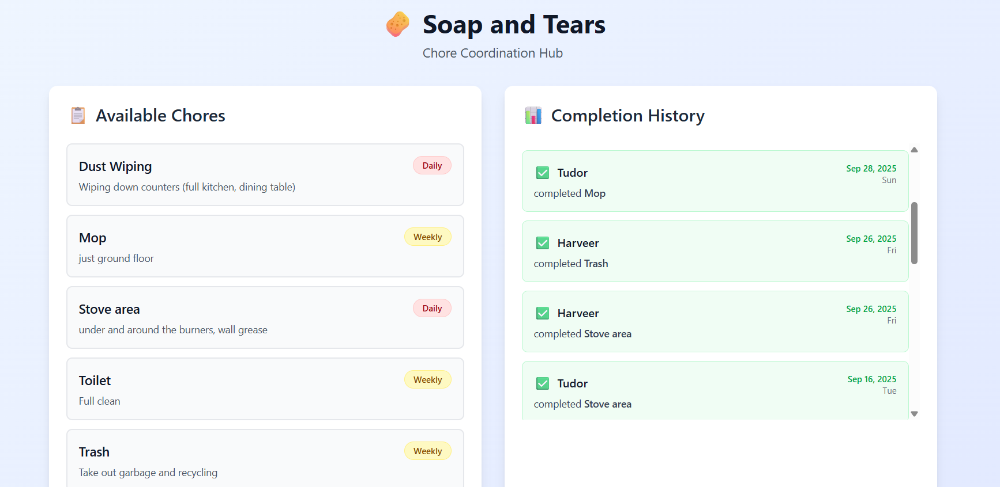

## Soap & Tears – Dorm Chore Manager

Keep a shared home clean without the drama. Soap & Tears is a simple web app and API for organizing, tracking, and visualizing household chores for roommates and dorms.

[](docs/ui.png)

### Why this exists

Keeping a shared living space clean is hard: people forget, expectations differ, and no one wants to nag. Soap & Tears makes chores explicit, fair, and visible with lightweight tracking and stats. It focuses on clarity over complexity so small groups can get started in minutes.

---

## Features

- **Chore catalog**: Define chores with name, description, and frequency.
- **Roommates (users)**: Manage the set of people in the house.
- **Completions (contracts)**: Record who did what and when.
- **Auto sample data**: Empty databases are auto-seeded to help you get going.
- **Stats dashboard API**: Summaries of who does which chores and how often.
- **Reset endpoint (dev)**: Quickly clear and reseed data during development.
- **Modern stack**: Next.js App Router API routes + Firebase Firestore.

---

## Tech Stack

- **Framework**: Next.js 15 (App Router, API routes)
- **Language**: TypeScript
- **UI**: React 19
- **Database**: Firebase Firestore (client SDK)
- **Styling**: Tailwind CSS 4 (postcss via `@tailwindcss/postcss`)
- **Tooling**: ESLint 9, Turbopack dev/build

---

## Data Model

- `User` – `{ id, name }`
- `Chore` – `{ id, name, description, frequency }`
- `Contract` (a completion record) – `{ id, uid, cid, completed_date, created_at, user_name?, chore_name? }`

Relationships are resolved at read time; stats are computed from completion history.

---

## Installation

1. Clone and install dependencies

```bash
git clone https://github.com/tudormatei/soap-and-tears.git
cd soap-and-tears
npm install
```

2. Configure environment variables (Firebase)

Create a `.env.local` file in the project root with your Firebase project settings:

```bash
NEXT_PUBLIC_FIREBASE_API_KEY=...
NEXT_PUBLIC_FIREBASE_AUTH_DOMAIN=...
NEXT_PUBLIC_FIREBASE_PROJECT_ID=...
NEXT_PUBLIC_FIREBASE_STORAGE_BUCKET=...
NEXT_PUBLIC_FIREBASE_MESSAGING_SENDER_ID=...
NEXT_PUBLIC_FIREBASE_APP_ID=...
NEXT_PUBLIC_FIREBASE_MEASUREMENT_ID=...
```

You can find these values in the Firebase Console under Project Settings → General. The app uses the client SDK to talk to Firestore.

3. Run the development server

```bash
npm run dev
# opens http://localhost:3000
```

The API will also be served from the same origin under `/api/*`.

---

## Usage

This project currently exposes a simple API for managing users, chores, and completions. On first use, the database auto-initializes with sample users and chores when you hit any data endpoint.

### API Endpoints

- `GET /api/users` – List users
- `POST /api/users` – Create user `{ name }`
- `GET /api/chores` – List chores
- `POST /api/chores` – Create chore `{ name, description?, frequency }`
- `GET /api/contracts` – List completion records
  - Filters: `?userId=<uid>` or `?choreId=<cid>`
- `POST /api/contracts` – Create completion `{ uid, cid, completedDate }`
- `GET /api/stats` – Aggregated completion stats by user and chore
- `POST /api/reset` – Clear all data and reseed sample data (development)

### Examples

Create a user:

```bash
curl -X POST http://localhost:3000/api/users \
  -H "Content-Type: application/json" \
  -d '{"name":"Alex"}'
```

Create a chore:

```bash
curl -X POST http://localhost:3000/api/chores \
  -H "Content-Type: application/json" \
  -d '{"name":"Trash","description":"Take out garbage and recycling","frequency":"Weekly"}'
```

Record a completion (contract):

```bash
curl -X POST http://localhost:3000/api/contracts \
  -H "Content-Type: application/json" \
  -d '{"uid":"<USER_ID>","cid":"<CHORE_ID>","completedDate":"2025-09-29"}'
```

Fetch stats:

```bash
curl http://localhost:3000/api/stats
```

### Initial Sample Data

On first read/write, if the database is empty the app seeds users (`Tudor`, `Harveer`, `Carlos`) and several chores (e.g., Stove area, Vacuum, Mop, Trash, Dust Wiping, Toilet).

---

## Configuration

- **Environment variables**: The app reads Firebase settings from `process.env.NEXT_PUBLIC_*` variables in `.env.local` as shown above. No secret server keys are used; Firestore security rules should be configured appropriately if deployed.
- **Ports**: Dev runs on `3000` by default.
- **Seeding**: Seeding occurs automatically when hitting the API if no data is present. A reset endpoint is provided for development.

---

## Contributing

Contributions are welcome! To propose changes:

1. Fork the repo and create a feature branch.
2. Make your changes with clear commit messages.
3. Ensure the app builds and the API endpoints work locally.
4. Run the linter and fix any issues:

```bash
npm run lint
```

5. Open a pull request describing the motivation, approach, and screenshots or API examples if applicable.

---

## Testing

There is no formal test suite yet. For now, validate behavior with curl/Postman against the API endpoints and add unit tests as the data layer grows. If you add tests, prefer TypeScript with a modern runner (e.g., Vitest or Jest), and keep them fast and deterministic.

---

## Deployment

### Vercel (recommended)

1. Push the repo to GitHub/GitLab/Bitbucket.
2. Import the project into Vercel.
3. Add the same `.env` variables under Vercel Project → Settings → Environment Variables.
4. Deploy. Next.js App Router API routes run as serverless functions by default.

### Other platforms

Any platform that supports Next.js can work. Ensure the environment variables are set and that Firestore is accessible from your deployed environment.

---

## FAQ / Troubleshooting

- **I get permissions errors from Firestore.**

  - Ensure your Firebase project exists and values in `.env.local` are correct.
  - Configure Firestore rules to allow the intended access pattern (authenticated or public for development).

- **The database looks empty.**

  - Hit `GET /api/users` or `GET /api/chores` to trigger seeding on a fresh project.
  - Use `POST /api/reset` to clear and reseed during development.

- **`NEXT_PUBLIC_*` env vars seem ignored.**

  - Verify `.env.local` exists in the project root and you restarted `npm run dev` after editing it.

- **Build fails on CI due to Tailwind or PostCSS.**
  - Ensure dev dependencies are installed and that `postcss.config.mjs` is present. Tailwind 4 uses the new PostCSS plugin package `@tailwindcss/postcss`.

---

## License

MIT License © Contributors. You are free to use, modify, and distribute this project with attribution and inclusion of the license. If you fork or distribute, consider keeping a `LICENSE` file with the MIT text.

---

## Acknowledgements / Credits

- Next.js team for the App Router and great developer experience.
- Firebase team for Firestore.
- Roommates everywhere who inspired the problem and the sample data.
